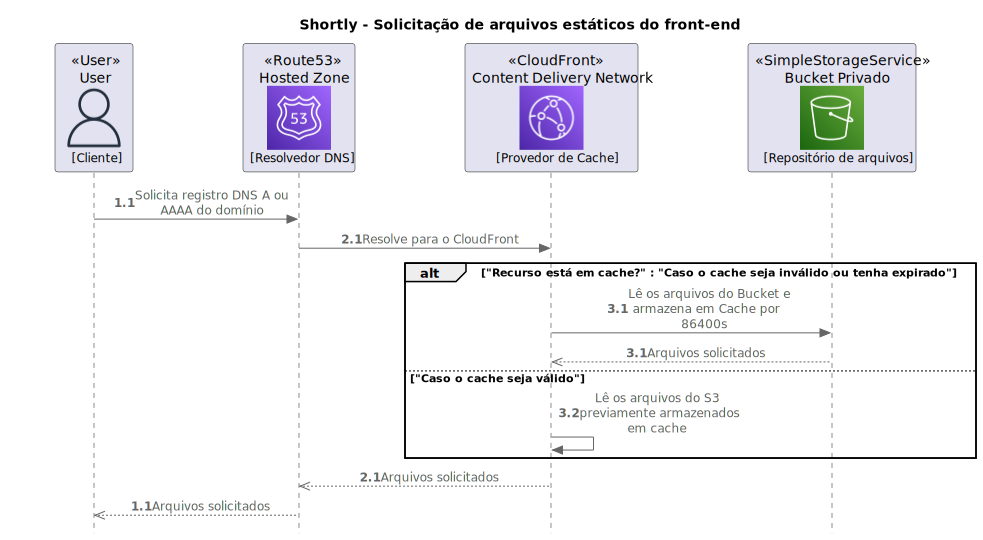

<h1 align="center">Shortly EC2 Web</h1>
<p align="center">
  
</p>
  <p align="center">
    
    
  </p>
<h2 align="center">
  This project was created using React, Vite.JS and Amazon Web Services.
</h2>
<p align="center">
  This project is the Shortly front-end, a simple application that uses React and Vite.JS and is provided by Amazon CloudFront and Amazon S3.
</p>
<p align="center">
   
  
  
  
</p>

## Architecture Overview

<p align="center">
  
</p>

## Metadata

```
Muryllo Pimenta – muryllo.pimenta@upe.br
```

Distributed under MIT license. See ``LICENSE`` for more informations.

## Contributing

1. Fork it (<https://github.com/MurylloEx/shortly-ec2-web/fork>)
2. Create your feature branch (`git checkout -b feature/fooBar`)
3. Commit your changes (`git commit -am 'Add some fooBar'`)
4. Push to the branch (`git push origin feature/fooBar`)
5. Create a new Pull Request
